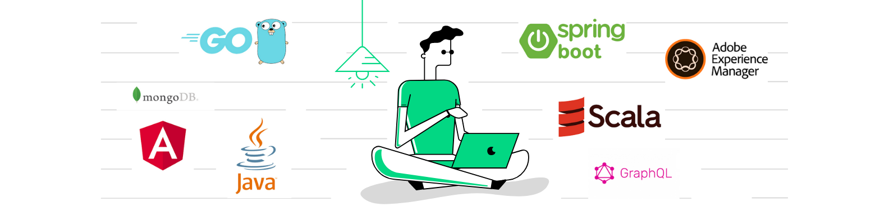

  </a>

- 👋 Hi, I’m Deepak , Programmer who followed programming languages Java , Scala and go @asksharmadeepak
- 👀 I’m interested in ...Building Quality Software
- 🌱 I’m currently learning ... GoLang / RUST / GraphQL
- 💞️ I’m looking to collaborate on ...GoLang
- 📫 How to reach me ...deepak.sharma@live.in

<!---
java-scala-go/java-scala-go is a ✨ special ✨ repository because its `README.md` (this file) appears on your GitHub profile.
You can click the Preview link to take a look at your changes.
--->
